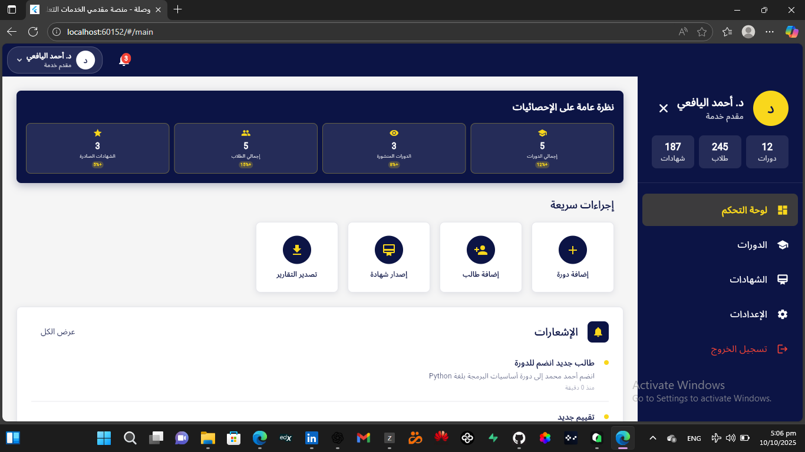
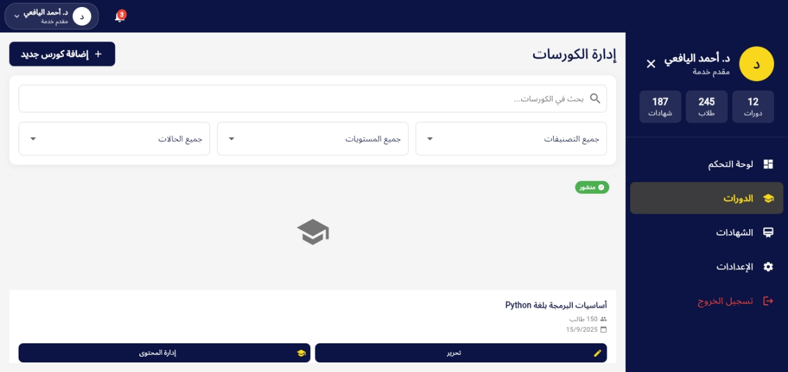
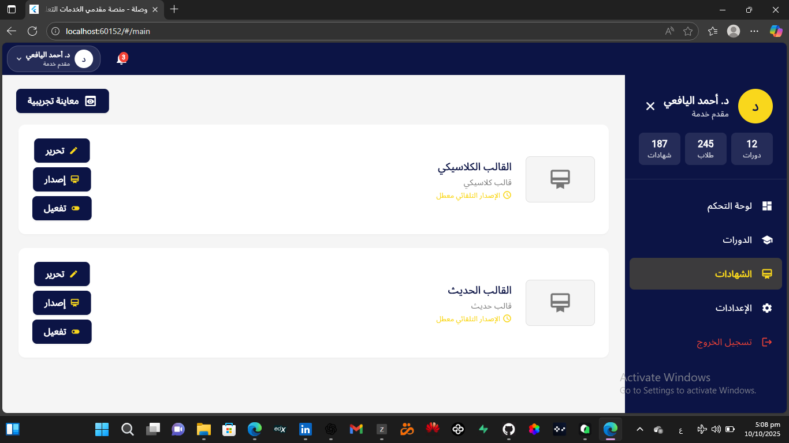
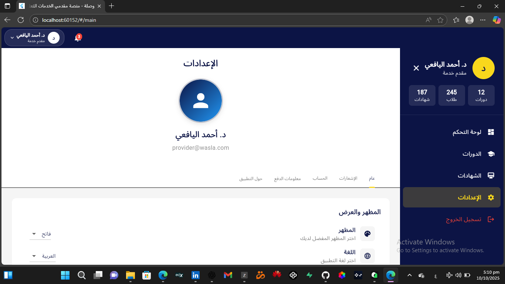

# Wasla - Educational Service Provider Platform

[](https://flutter.dev/)
[](LICENSE)

A comprehensive educational service provider platform built with Flutter. This application provides a complete dashboard for educational content providers to manage courses, students, certificates, and more.

## 📱 Screenshots

<div style="display: flex; flex-wrap: wrap; gap: 10px;">
  
  
  
  
</div>

## 🌟 Features

### Core Functionality
- **Arabic RTL Support**: Fully localized Arabic interface with right-to-left layout
- **Course Management**: Create, edit, and manage educational courses
- **Student Management**: Track and manage student enrollments and progress
- **Certificate Generation**: Create and customize professional certificates
- **Content Management**: Organize course materials and resources
- **Dashboard Analytics**: Visualize key metrics and performance indicators

### Technical Features
- **Responsive Design**: Works seamlessly on mobile, tablet, and desktop
- **State Management**: Implemented with Flutter Bloc pattern
- **Local Data Storage**: Uses SharedPreferences for offline data persistence
- **Modern UI/UX**: Material Design with custom Arabic styling
- **Multi-platform**: Supports Android, iOS, Web, and Desktop

## 🛠️ Technologies Used

- **Framework**: [Flutter](https://flutter.dev/)
- **State Management**: [Flutter Bloc](https://pub.dev/packages/flutter_bloc)
- **Local Storage**: [Shared Preferences](https://pub.dev/packages/shared_preferences)
- **UI Components**: [Material Design](https://material.io/)
- **Localization**: [Flutter Localizations](https://flutter.dev/docs/development/accessibility-and-localization/internationalization)
- **Utilities**: 
  - [Equatable](https://pub.dev/packages/equatable)
  - [Intl](https://pub.dev/packages/intl)
  - [Path Provider](https://pub.dev/packages/path_provider)
  - [Screenshot](https://pub.dev/packages/screenshot)

## 🚀 Getting Started

### Prerequisites

- Flutter SDK (3.4.3 or higher)
- Dart SDK
- Android Studio / Xcode (for mobile development)
- VS Code or Android Studio (recommended IDEs)

### Installation

1. **Clone the repository**
   ```bash
   git clone https://github.com/your-username/course_provider.git
   cd course_provider
   ```

2. **Install dependencies**
   ```bash
   flutter pub get
   ```

3. **Run the application**
   ```bash
   flutter run
   ```

### Supported Platforms

- Android
- iOS
- Web
- Windows
- macOS
- Linux

## 📁 Project Structure

```
lib/
├── bloc/                 # State management with Bloc
│   ├── auth/
│   ├── certificate/
│   ├── course/
│   ├── navigation/
│   ├── settings/
│   └── student/
├── config/               # Application configuration
├── data/                 # Mock data and repositories
├── models/               # Data models
├── repository/           # Data access layer
├── routing/              # Application routing
├── screens/              # Application screens
├── theme/                # Theme and styling
├── utils/                # Utility functions
└── widgets/              # Custom widgets
```

## 🎨 UI Components

The application includes a rich set of custom widgets:

- **Course Cards**: Interactive cards for course display
- **Statistics Cards**: Visual data representation
- **Custom Text Fields**: RTL-compatible input fields
- **Dialog Components**: Custom modal dialogs
- **Navigation Components**: Sidebar and bottom navigation

## 📊 Dashboard Features

- Real-time analytics visualization
- Course performance tracking
- Student engagement metrics
- Revenue and enrollment statistics
- Quick access to management tools

## 🔧 Development

### Code Quality

- Follows Flutter best practices
- Implements clean architecture principles
- Uses Bloc for predictable state management
- Comprehensive error handling

### Testing

```bash
# Run unit tests
flutter test

# Run widget tests
flutter test test/widget_test.dart
```

## 🤝 Contributing

1. Fork the repository
2. Create your feature branch (`git checkout -b feature/AmazingFeature`)
3. Commit your changes (`git commit -m 'Add some AmazingFeature'`)
4. Push to the branch (`git push origin feature/AmazingFeature`)
5. Open a Pull Request

## 📄 License

This project is licensed under the MIT License - see the [LICENSE](LICENSE) file for details.

## 🙏 Acknowledgments

- Thanks to the Flutter community for the amazing framework
- Inspired by modern educational platforms
- Built with ❤️ for Arabic-speaking educators

## 📞 Support

For support, email [your-email@example.com] or open an issue in the repository.